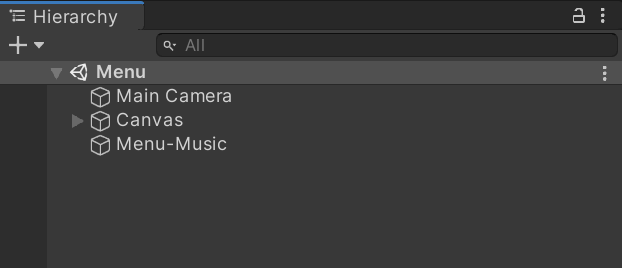
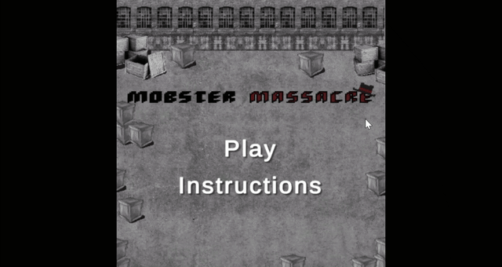
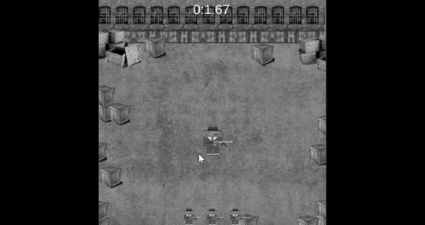
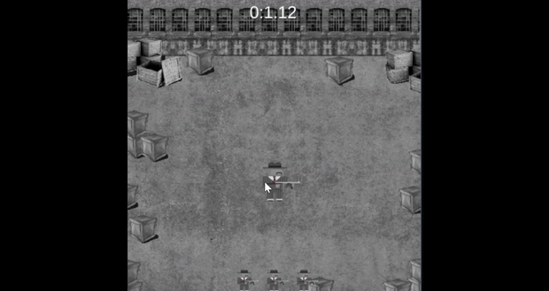

# Mobster Massacre

## Developers

- Kevin Nguyen - Programmer, Producer
- Aaron Arthur Chin - Artist, Designer

## Description

- Mobster Massacre falls under the genre of SHMUP games, also known as shoot 'em up. The plot of this game is that any enemy mafia is attacking your gang's hideout. Hold out as long as possible to help your friends escape!
- When the game is first launched, the player will be directed to a menu that contains the instructions if they would like to learn how to play
- Enemies will track towards the player and the game will progressively get harder by adding more enemies
- Minimal UI will be present, for example the amount of lives the player has left as well as how much time has elapsed
- There will be a game over screen that tells the player how long they survived, compete with your friends to see who lives the longest!

## File Info

- [**Sprites**](https://github.com/kevinvietnguyen/MobsterMassacre/tree/main/Assets/Sprites) contains sprites of :
  - Mafia boss (player)
  - Mafia enemies
  - Incoming projectiles
  - Animations for the boss and enemies
  - Title and UI
  - Background
- [**Scripts**](https://github.com/kevinvietnguyen/MobsterMassacre/tree/main/Assets/Scripts) contains scripts of:
  - Boundaries
  - Collisions
  - Enemies spawners
  - Rate of enemies
  - Timer/Life UI
  - Projectile direction
  - Music

## Build Instructions
1. Install Unity 2019.4.21 on [Windows](https://download.unity3d.com/download_unity/b76dac84db26/UnityDownloadAssistant-2019.4.21f1.exe) or [Mac](https://download.unity3d.com/download_unity/b76dac84db26/UnityDownloadAssistant-2019.4.21f1.dmg) (If Unity Hub is already installed, click [here](https://unity3d.com/unity/whats-new/2019.4.21) to install this version onto your system).
2. Clone repository to a directory
3. On Unity Hub, click on ADD and select the "MobsterMassacre" folder.
4. Go into the "Scenes" folder and drag the "Menu" scene onto the Hierarchy window. Remove any other scenes.

  

5. Choose your target platform and architecture and press "Build".
6. Play! 

## Play Our Game!

[**Click here to play!**](https://kevinvietnguyen.itch.io/mobster-massacre):

 

   
  <h2>Title Screen</h2>
  
   
   
  <h2>Gameplay</h2>
  
   
   
  <h2>End Screen</h2>
  
   

